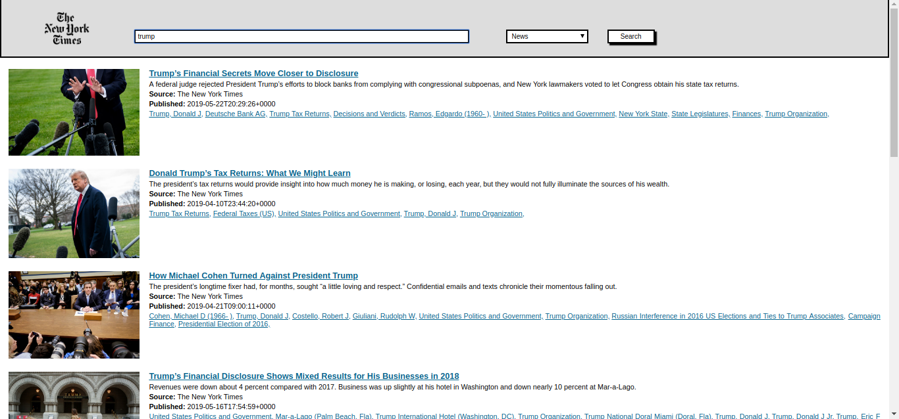

<h1>New York Times React Search</h1><br/>
Web application using React and the NYT article search API.

<h2>How to use?</h2>

Using the console open the main folder of the project and type the following commmands: 
```
$ npm install //This will install the main dependencies of the project
$ npm start //This will start executing the project
```
The app will start runing in port 3000 in the browser and you'll see the following views:


You can now start searching by keywords and material type. Let's search for example: "trump", you will see something like this: 



If you open the app using your phone, you will have the next views:


For every search you will see the first ten results, if you want to see more, press the "See More News" button and see ten more.
